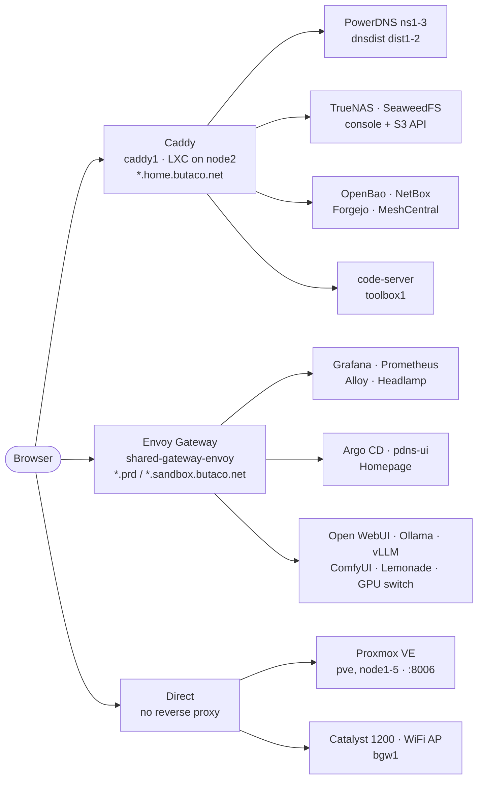

# Service Routing

How a browser request reaches each homelab service. There are three ingress
paths and they do not overlap: the zone in the hostname tells you which one is
in play.

| Zone | Ingress | TLS |
|---|---|---|
| `*.home.butaco.net` | Caddy on `caddy1` (LXC, node2) | Let's Encrypt, ACME DNS-01 via Cloudflare |
| `*.prd.butaco.net` | Envoy Gateway (`shared-gateway-envoy`, prd cluster) | cert-manager wildcard certificate |
| `*.sandbox.butaco.net` | Envoy Gateway (sandbox cluster) | none — HTTP only (ADR-0010) |
| everything else | direct to the device | device-local certificate, or plain HTTP |

Caddy has no web UI: its configuration is generated from
`caddy_upstreams` / `caddy_redirects` in
[`group_vars/caddy.yaml`](../ansible/inventories/homelab/group_vars/caddy.yaml)
through [`Caddyfile.j2`](../ansible/roles/caddy/templates/Caddyfile.j2). This
document and [`scripts/check-proxy-routes.sh`](../scripts/check-proxy-routes.sh)
are the substitute for one — the script fails CI when a Caddy site and its
Homepage tile drift apart.

## Ingress paths



## Caddy sites

Backends are written as inventory host names; the addresses come from
[`hosts.yaml`](../ansible/inventories/homelab/hosts.yaml) and are not repeated
here.

| Hostname | Backend | Notes |
|---|---|---|
| `pdns1.home.butaco.net` | `ns1:8081` | PowerDNS authoritative (primary) |
| `pdns2.home.butaco.net` | `ns2:8081` | PowerDNS authoritative (secondary 1) |
| `pdns3.home.butaco.net` | `ns3:8081` | PowerDNS authoritative (secondary 2) |
| `dnsdist1.home.butaco.net` | `dist1:8083` | dnsdist console |
| `dnsdist2.home.butaco.net` | `dist2:8083` | dnsdist console |
| `forgejo.home.butaco.net` | `forgejo1:3000` | Git |
| `truenas-ui.home.butaco.net` | `192.168.20.10:443` | HTTPS upstream, self-signed (ADR-0008); not Ansible-managed, so the address is a literal |
| `netbox-ui.home.butaco.net` | `netbox1:80` | IPAM |
| `openbao.home.butaco.net` | `openbao1:8200` | Secrets |
| `auth.home.butaco.net` | `authentik1:9000` | Identity provider |
| `s3.home.butaco.net` | `seaweedfs1:8333` | S3 API — no UI, deliberately absent from the dashboard |
| `seaweedfs-ui.home.butaco.net` | `seaweedfs1:23646` | SeaweedFS console |
| `meshcentral.home.butaco.net` | `rpi4:8443` | Out-of-band management (ADR-0025) |
| `vscode.home.butaco.net` | `192.168.20.21:8080` | code-server on `toolbox1` (ADR-0031) |

## Not behind Caddy

These are reached directly and will never appear in `caddy_upstreams`:

- **Proxmox VE** (`pve`, `node1`–`node5`) on `:8006`. The explicit port is what
  marks them as direct in `check-proxy-routes.sh`.
- **Network appliances** — `c1200` (L3 switch), `wifiap1`, `bgw1` — over plain
  HTTP.
- Anything in the clusters, which goes through the Gateway API `HTTPRoute` of
  its own chart instead.

## Adding a service

1. Add the site to `caddy_upstreams` in
   `ansible/inventories/homelab/group_vars/caddy.yaml`.
2. Add the matching tile to
   `k8s/homepage/chart/config/services.yaml`, and bump the group's `columns` in
   `settings.yaml` if the row no longer fits.
3. Run `./scripts/check-proxy-routes.sh` — it fails on a site with no tile, and
   on a tile pointing at a host Caddy does not serve.
4. Apply Caddy's side. The playbook's `sync_dns` play derives the
   `home.butaco.net` A record from the same list, so no manual DNS work is
   needed:

```bash
ansible-playbook playbooks/caddy.yaml --check --diff
```

Homepage is reconciled by Argo CD once the change is on `main`.
